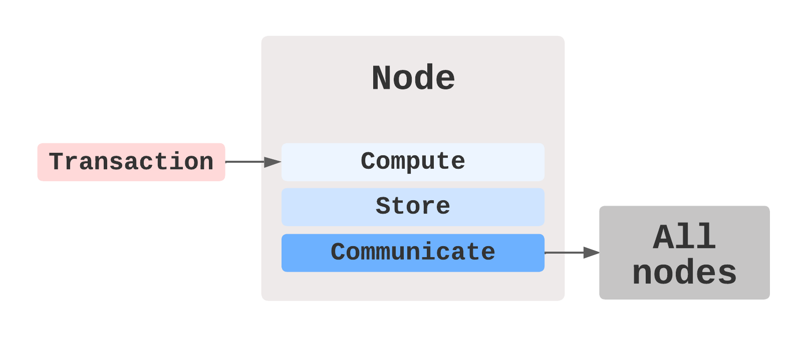
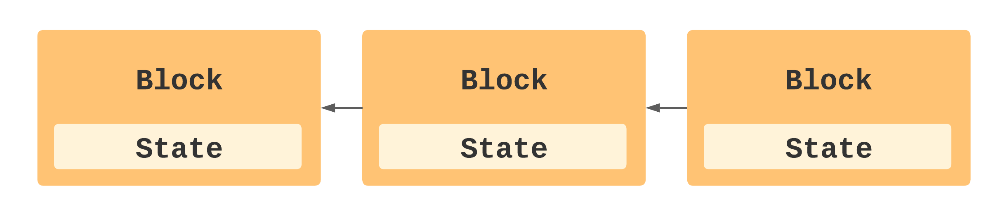

# NEAR in the Web 3 World

Welcome to the third batch of OWS Education by the Open Web Sandbox. Our team is creating these documents to smooth out the onboarding process for new members of our community. This month’s edition is on NEAR basics! Let’s dive in!



To understand where NEAR fits into the Web 3 world, we must look into the same questions we answered about Web 3 in our previous batch about Blockchain Basics - these are:

* Where is data computed and stored?
* Who stores and controls the data?
* Who owns the data?

Let’s begin with the first question.

### Where is data computed and stored?

Users interact with the NEAR blockchain through the userface of DApps. When interacting with DApps through actions, text, images or uploads, the smart contracts the DApps are composed of create transactions requesting for these interactions to be executed on-chain.\

> Transactions represent actions requested by the blockchain user, e.g. send assets, create account, execute a method, etc.
>
> [NEAR Nomicon](https://nomicon.io/Architecture)

\
The transactions are then communicated to nodes that make up the NEAR network. Once the transactions are communicated to nodes, a set of nodes is randomly selected by the consensus algorithm to become validator nodes. Validator nodes compute and store the data found in transactions and communicate their work to all other network nodes.

Let’s look into how nodes do this.

Nodes can be described as having two layers, the runtime layer and the blockchain layer. The runtime layer is responsible for computing transaction’s data, it is a decentralised virtual machine that is oblivious about whether it is running on a blockchain at all. On the other hand, the blockchain layer is responsible for feeding transactions to the runtime virtual machine, and storing the output accordingly as blocks.

.png>)

### Who stores and controls the data?

Once the transactions from the smart contracts are computed by the runtime layer, the validator nodes use the blockchain layer to store the computed transactions onto blocks, updating the state of the NEAR blockchain, and communicating it to all other nodes, so that they can all update their state. This process is autonomous and is executed following a secure and decentralised PoS consensus mechanism, which will be the focus of the third video of this batch.

### .png>)

### Who owns the data?

Data is transparently stored on blockchains, as you can see at NEAR Explorer. Because this data was computed and stored by randomly selected nodes, and communicated to every node of the network, there is no node that can edit or remove what has been computed and stored on NEAR blocks. The NEAR Protocol, as an entity, or the NEAR Foundation, do not have any more or privileged access to this data than its users. Additionally, DApps or DAOs on NEAR are either fully or partially governed by their users, who partake in the decision making process of their development.\
We have concluded our description of how NEAR fits into the Web 3 world.

To look further into NEAR as an instance of Web 3, we can see how it handles the problems posed by the Blockchain Trilemma, namely: scalability, decentralisation, and security.

In the next three documents we will look into how NEAR aims to overcome the Blockchain Trilemma.

### About Open Web Sandbox

A human-centric digital hub for everyone wishing to engage with projects building on top of the NEAR Protocol.

[Twitter](https://near.org/sandbox/) | [Website](https://twitter.com/OpenWebSandbox)

Written by [Jacopo Nuti](https://medium.com/@jacopo\_nuti).\
