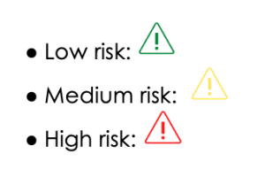

# AML/CFT Risk Assessment and Recommendations

Created by **** [Santiago Chamat](https://nearlegal.com/santiago/) and [Edo Bakker](https://nearlegal.com/edo/) of the NEAR **** [Legal Guild](https://nearlegal.com)**.** Originally published [here](https://nearlegal.com/ows\_risk-assessment-recommendations/).

### **INDEX**

1. Introduction
2. AML/CFT Risk Assessment
3. Conclusion
4. Next Steps
5. About This Document

_Annex_ I_: High-risk and other monitored jurisdictions_

_Annex II: OWS rewards and opportunities program ****_&#x20;

### **What is OWS?**

The Open Web Sandbox (OWS) operates as an open-source community within the NEAR ecosystem, setting up a common space for contributors, projects, and teams to collaborate and work on different initiatives across the ecosystem for rewards in USD and an equivalent is paid out in the native token – $NEAR. Like other ecosystems where value is transferred from one party to another, there exists a risk of money laundering, terrorist financing, international sanctions violations, and other compliance risks (e.g., tax evasion).&#x20;

### **Why a risk assessment?**

* Analyze vulnerability to money laundering and related risks
* Establish minimum controls to mitigate risks
* Comply with laws and regulations
* Reduce operational and reputational risk

#### **How will we assess the risks?**&#x20;

Based on quantitative and qualitative data, specific risks will be rated according to the following scale:

#### **What will be the outcome?**&#x20;

This risk assessment will help to establish the next steps in order to manage the identified risks.

### **2. AML/CFT Risk Assessment**

#### &#x20;**2.1 Activity, products & services**

The Open Web Sandbox (OWS) has been built to encourage participation and collaboration on different activities in the NEAR Ecosystem allowing its members to actively engage with their own activities and other opportunities enlisted by the community.&#x20;

Through the OWS rewards and opportunities program (for details see Annex II) users can engage with the rest of the community and explore opportunities made available by them or the OWS. As a registered contributor, at the end of the month, the member can claim rewards for each of the activities he/she worked on. This will be evaluated by the OWS Council and the contributor receives rewards in $NEAR.

### Full Document:


Full Document - OWS AML/CFT Risk Assessment & Recommendations


